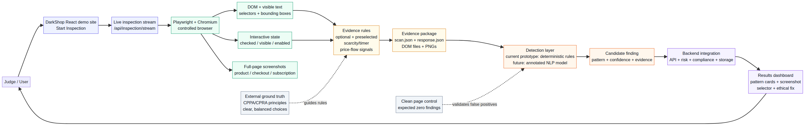
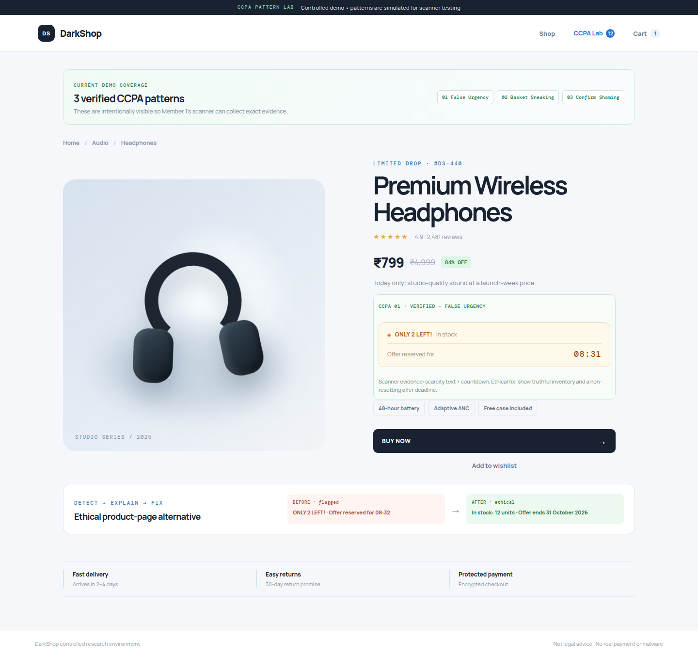
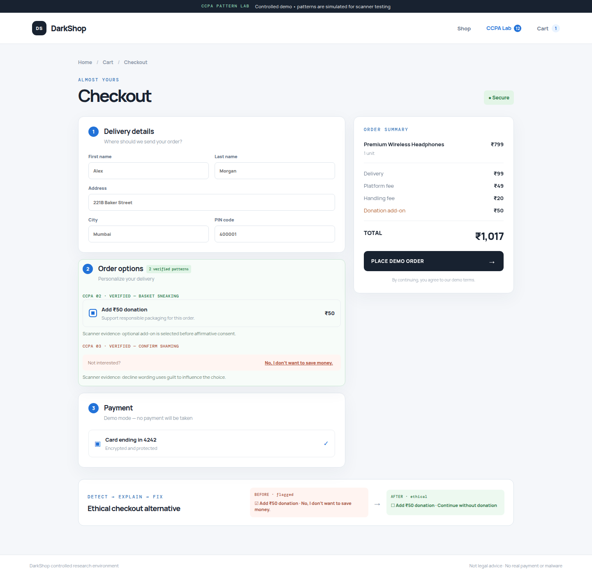
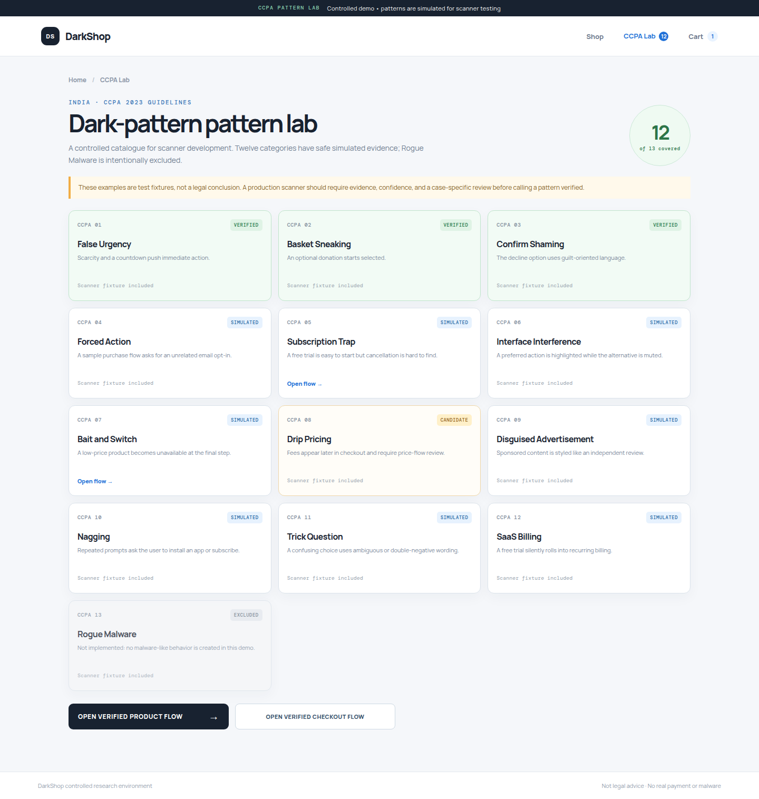
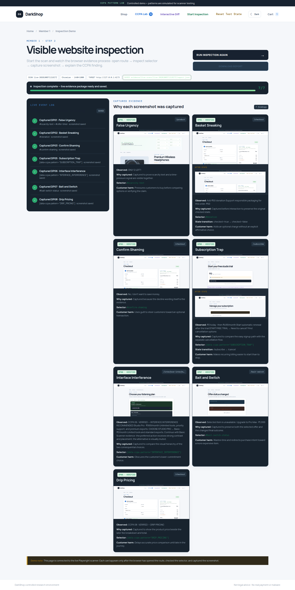
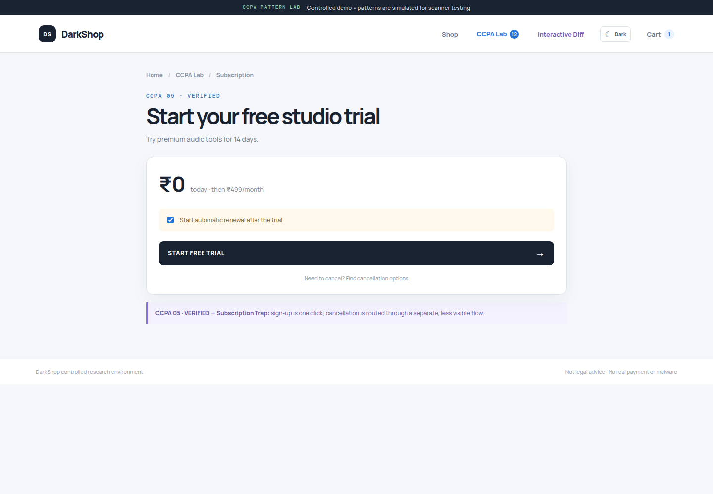

# ShadowBait / DarkPatternGuard
## Judge-Ready Prototype Guide

**Purpose:** Explain what the prototype does, how it identifies dark-pattern candidates, what evidence it produces, and how to answer questions about datasets, models, CCPA, and limitations.

> **One-sentence explanation**
>
> ShadowBait is a controlled, evidence-first dark-pattern inspection prototype: it opens a website in a real browser, captures the DOM and interaction state, saves screenshots, applies transparent rules to identify suspicious interface signals, and returns findings that a later backend/dashboard can score and explain.

**Important scope statement:** The current prototype is **not a legal decision-maker** and does **not currently train or run a neural network**. Its demonstrated scanner is deterministic and rule/evidence-based. The architecture documents mention NLP/DeBERTa as a future or team-owned detection extension; do not claim that a trained neural model is already operating unless your friends add and demonstrate that module.

---

## 1. What the prototype currently demonstrates

The demo site intentionally contains controlled examples of dark-pattern-like interface choices. These are not accidental findings from an unknown production website; they are **known ground-truth fixtures** created so that the scanner can be tested repeatably.

The current demonstrated findings include:

| ID | Pattern | Demonstrated signal | Main evidence |
|---|---|---|---|
| DP01 | False Urgency | “ONLY 2 LEFT!” beside a countdown timer | Product screenshot, visible text, selectors, timer state |
| DP02 | Basket Sneaking | Optional ₹50 donation checkbox starts checked | Checkout screenshot, `#donation`, `checked=true`, before/after state |
| DP03 | Confirm Shaming | “No, I don’t want to save money.” | Checkout screenshot, exact text, selector |
| DP05 | Subscription Trap | Trial is easy to start; cancellation is a separate multi-step flow | Start/cancel screenshots and route comparison |
| DP06 | Interface Interference | Recommended paid option is visually prominent; Basic is muted | Screenshot, selectors, visual state |
| DP07 | Bait and Switch | ₹799 selection becomes unavailable and redirects toward ₹1,999 | Screenshot, selected-offer and final-state text |
| DP08 | Drip Pricing | Delivery/platform/handling fees appear in the later checkout flow | Checkout screenshot and price text |

The prototype also includes a **clean comparison page**. It intentionally uses transparent stock, neutral labels, unchecked optional add-ons, complete pricing, and balanced choices. This page is a false-positive control: the scanner should not report the targeted dark-pattern signals there.

---

## 2. Architecture in one picture



The editable diagram source is `shadowbait_judge_architecture.mmd`.

### End-to-end sequence

1. The user opens the React DarkShop demo and chooses **Start Inspection**.
2. The inspection stream connects to the Playwright/Chromium inspection service.
3. Chromium opens each controlled route such as `/product`, `/checkout`, `/subscribe`, and `/bait-switch`.
4. The scanner reads the live DOM, visible text, stable selectors, element positions, and interactive state.
5. It captures full-page screenshots and DOM/text evidence.
6. Transparent evidence rules produce candidates from observable signals.
7. The evidence writer saves `scan.json`, `response.json`, screenshots, HTML, and text JSON.
8. A future or team-owned detection layer can enrich those candidates with language classification and confidence.
9. The backend can combine findings with risk, compliance mapping, storage, and recommendations.
10. The dashboard presents the finding, evidence, screenshot, explanation, and ethical fix.

---

## 3. What happens when the Inspection button is clicked?

The inspection button is not connecting to an external “bottled ad framework.” In the current implementation it connects to the project’s **live Playwright inspection API** using a Server-Sent Events stream.

Conceptually:

```text
Start Inspection
    ↓
EventSource → /api/inspection/stream
    ↓
Inspection server launches Playwright + Chromium
    ↓
Chromium visits controlled DarkShop routes
    ↓
DOM/text/state/screenshots are captured
    ↓
Evidence is written to evidence/live-scans/live-<timestamp>/
    ↓
Progress events and findings return to the UI
```

The frontend receives events such as `started`, `stage`, `finding`, `complete`, and `error`. The complete event includes the saved paths for `scan.json`, `report.json`, and `response.json`.

---

## 4. Dataset question: what should we tell the judges?

### Recommended answer

> We are not claiming to have trained a supervised neural network on a large dark-pattern dataset. The current prototype uses a controlled, labeled test website as ground truth and an evidence-first rule engine. Each fixture has a known expected pattern, stable selector, expected text/state, and expected screenshot. This lets us test whether the scanner observes the correct evidence and whether the system avoids false positives on a clean control page. A future machine-learning extension would require a separately annotated dataset of real interface examples, with clear labeling guidelines and inter-annotator agreement.

### Why this is a valid engineering choice

Dark patterns are contextual. A checked checkbox is not automatically deceptive: it matters whether it is optional, whether it adds an unrelated cost, whether the user understands it, and whether the primary action requires it. A small, carefully controlled test fixture is therefore useful for validating the **measurement pipeline** before attempting generalization.

The current repository contains:

- Controlled demo fixtures with known labels.
- A checked-in evidence report.
- Screenshot and DOM evidence.
- A clean-page false-positive control.
- Automated output verification.

These are a **prototype evaluation set**, not a claim of a broad public training dataset.

### If a judge asks, “What dataset did you use?”

Answer in three layers:

1. **For this prototype:** a controlled, self-authored ground-truth test set embedded in the DarkShop demo.
2. **For external grounding:** CPPA/CPRA principles and official dark-pattern guidance define the design concerns the rules operationalize.
3. **For future ML:** a curated, consented, manually annotated corpus of real interfaces would be collected; it is not part of the current demonstrated scanner.

Do not invent a dataset name, accuracy score, or trained model that is not present in the running code.

---

## 5. How does the system distinguish a normal checkbox from Basket Sneaking?

The system should not say “checked means dark pattern.” The actual reasoning is a multi-signal test:

```text
visible checkbox
    AND checked before affirmative user action
    AND optional rather than required for the primary task
    AND represents an add-on / extra cost / unrelated consent
    AND label and page context support that interpretation
    → Basket Sneaking candidate
```

For the demo’s donation checkbox, the observable evidence is:

- Selector: `#donation`
- Text: `Add ₹50 donation`
- State before interaction: `checked = true`
- It is optional, because the main checkout can continue without it.
- It changes the total payable amount.
- The scanner safely unchecks it and records the state transition.
- A screenshot preserves the original state.

A normal checkbox should not be flagged when, for example:

- It is required for the primary service and clearly disclosed.
- It is already selected because it represents the user’s explicit, previously saved preference.
- It is not an add-on or unrelated consent.
- It is unchecked or neutral by default.
- The clean control page uses an optional unchecked add-on and neutral wording.

The scanner produces **evidence and a candidate**. A human, policy rule, or later classifier makes the final interpretation. This separation is important because dark-pattern assessment is contextual and effect-based.

---

## 6. Is the prototype using a neural network?

### Current answer

> Not in the demonstrated scanner path. The current prototype uses Playwright/Chromium for browser automation and deterministic DOM, text, state, and pricing rules for transparent evidence collection. The repository architecture reserves a detection-intelligence layer where an NLP model could be added later, but a model is not required to prove that the scanner can capture evidence correctly.

### Why start without a neural network?

A rule/evidence baseline is easier to:

- Explain to judges.
- Debug when a selector or screenshot is wrong.
- Test with exact expected outputs.
- Trace from finding back to the UI element.
- Evaluate on a small controlled fixture.
- Use without pretending that a small synthetic dataset supports generalization.

A future model could classify language such as urgency or guilt, but it should consume the scanner’s evidence rather than replace it. The model’s output should remain linked to the exact text, selector, page, and screenshot that support the decision.

### Future ML extension

A credible future plan would be:

1. Define annotation guidelines for each pattern.
2. Collect diverse interface examples with permission.
3. Have multiple annotators label each example.
4. Measure agreement and resolve disagreements.
5. Split by website/domain to prevent leakage.
6. Train a language classifier only for language-dependent patterns.
7. Combine model confidence with structural signals.
8. Report precision, recall, F1, calibration, and false-positive results.
9. Keep a human-review or “candidate” state instead of claiming automatic legal conclusions.

---

## 7. What makes this more than a screenshot tool?

The screenshot is only one part of the evidence bundle. The scanner also records:

- Requested and final URL.
- Page title and route.
- Visible text.
- Stable selectors.
- Tag and control type.
- Visibility and enabled state.
- Checkbox/radio state.
- Bounding box coordinates.
- Computed visual properties.
- DOM HTML.
- Before/after interaction state where safe.
- Pattern-specific explanation and ethical fix.

This allows a reviewer to reproduce the reasoning:

```text
Finding → exact text/selector/state → screenshot + DOM → explanation
```

That traceability is the core value of the prototype.

---

## 8. Evidence folder and files

Standalone scanner output:

```text
evidence/scans/<scan-id>/
├── screenshots/
├── dom/
└── scan.json
```

Report output:

```text
evidence/reports/<scan-id>/response.json
evidence/reports/response.json
```

Live Inspection output:

```text
evidence/live-scans/live-<timestamp>/
├── screenshots/
├── dom/
├── scan.json
├── report.json
└── response.json
```

The evidence verifier is:

```text
scripts/verify_scan_outputs.py
```

It checks that screenshots are non-empty, JSON is valid, referenced artifacts exist, and the scan/report summaries agree.

---

## 9. UI evidence from the current prototype

### Product page: False Urgency



The product fixture combines scarcity text and a countdown. The scanner records both the visible text and the timer element rather than relying only on an image.

### Checkout page: Basket Sneaking, Confirm Shaming, and Drip Pricing



The checkbox starts selected, the decline wording is guilt-oriented, and later fees are visible in the checkout price flow. The scanner records the checkbox state before and after a safe uncheck.

### CCPA pattern lab



The lab distinguishes **VERIFIED**, **SIMULATED**, and **EXCLUDED** examples. This is important: not every catalog item is claimed to be implemented or detected by the scanner.

### Live inspection view



The live view shows progress events and evidence cards as the inspection service completes each finding.

### Subscription example



The subscription example is supported by a start-flow screenshot and a separate cancellation-flow screenshot.

---

## 10. Suggested judge questions and short answers

### “Is this a legal compliance tool?”

> No. It is a research and engineering prototype that operationalizes selected dark-pattern signals and produces evidence for human review. It does not issue a legal determination.

### “Why does CCPA matter if your demo also shows shopping patterns?”

> The CCPA/CPRA context provides the privacy-choice and consent principles we use as a design reference, such as clear, balanced, understandable choices. The demo uses broader UX dark-pattern examples to make the scanner and evidence pipeline visible. We clearly label what is verified, simulated, or excluded.

### “What is your ground truth?”

> The controlled DarkShop fixtures are ground truth for the prototype: we know which routes contain which patterns, which selectors should be found, what state should be captured, and what screenshots should be produced. The clean page is a negative control.

### “What is your accuracy?”

> For the current controlled fixture, we report verification checks such as expected findings, expected pages, non-empty screenshots, valid JSON, and zero targeted signals on the clean control page. We do not present this as general-world model accuracy. Broader accuracy requires a labeled external evaluation corpus.

### “Can a normal checkbox be flagged incorrectly?”

> Yes, if the rule is poorly designed; that is why the system uses context and reports a candidate with evidence instead of a final legal verdict. Optionality, default state, relation to the primary task, price effect, wording, and clean-page controls reduce false positives.

### “How do you prevent hallucinated evidence?”

> Findings must reference observed page text, selectors, state, DOM artifacts, and screenshots. The verifier checks that referenced files exist. The prototype never treats an unsupported finding as verified evidence.

### “What happens if the website changes?”

> Stable selectors and evidence checks will expose breakage. If a selector disappears or a route fails, the scan should fail or report an inaccessible page rather than silently inventing a finding.

### “Why not train a model first?”

> Because the first engineering risk is reliable observation and evidence packaging. A model trained before the evidence contract and labels are stable would be difficult to audit and easy to overclaim.

---

## 11. Demo script for the presentation

1. Open the DarkShop demo at `/product`.
2. Point out the scarcity text, timer, and the visible CCPA pattern label.
3. Open `/checkout` and point out the pre-selected donation checkbox, later fees, and confirm-shaming text.
4. Open `/inspect` and click **Start Inspection**.
5. Explain that Playwright opens the controlled routes in Chromium.
6. Show progress events and the evidence cards.
7. Open the local `evidence/live-scans/` folder after completion.
8. Open `response.json` and show that findings include pattern ID, text, selector, screenshot path, and explanation.
9. Open `/clean-page` and explain that it is the negative control.
10. Run `scripts/verify_scan_outputs.py` and show `PASS: scan output is complete`.
11. Explain the limitation: current detection is transparent rules/evidence; ML is a future extension, not a claim of the current prototype.

### Demo video placement

When you attach the demo video, add it to the same `docs/judge-guide/` folder and replace this line with the actual filename or link:

```text
Demo video: [attach or link the recorded inspection walkthrough here]
```

---

## 12. Limitations and next steps

### Current limitations

- Controlled demo pages are not a representative sample of the entire web.
- Current demonstrated detection is rule/evidence-based, not a trained neural model.
- CCPA/CPRA interpretation is contextual and requires legal/policy review.
- The prototype does not claim universal dark-pattern coverage.
- Visual manipulation and language meaning can require human review.

### Strong next steps

1. Finish the shared JSON contract between scanner, detection, backend, and frontend.
2. Add automated integration tests for the full scan-to-dashboard path.
3. Add a versioned annotation schema and manual review workflow.
4. Build a consented multi-site evaluation corpus.
5. Add a model only after the rule baseline and labels are stable.
6. Compare rule-only, model-only, and fused results.
7. Report false positives on clean pages and false negatives on held-out examples.
8. Keep all output explainable and linked to evidence.

---

## Sources and framing references

- [California Privacy Protection Agency — Enforcement Advisory on Dark Patterns](https://cppa.ca.gov/announcements/2024/20240904.html)
- [California Privacy Protection Agency — Enforcement Advisory PDF](https://cppa.ca.gov/pdf/enfadvisory202402.pdf)
- [Federal Trade Commission — Bringing Dark Patterns to Light](https://www.ftc.gov/reports/bringing-dark-patterns-light)
- Project implementation: `scripts/member1_inspection.py`, `backend/inspection_server.py`, `demo-site/src/main.jsx`, and `docs/architecture/DarkPatternGuard_Architecture.d2`

> This guide is a technical explanation of the prototype, not legal advice.
